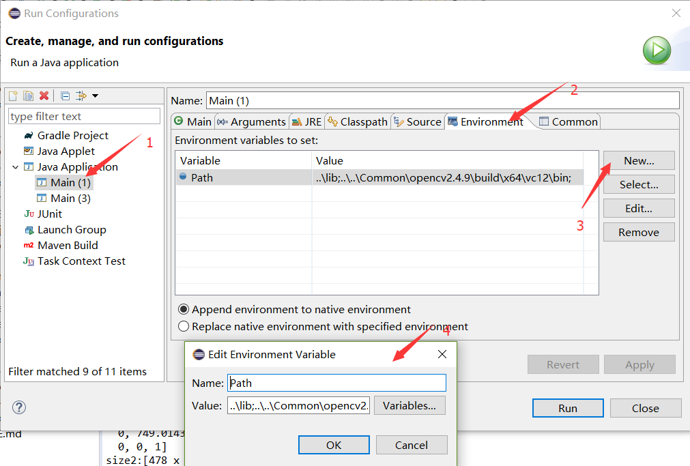
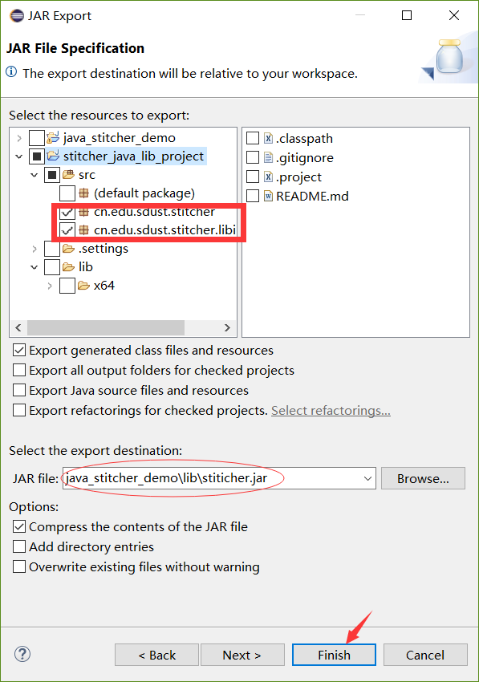

# 图片拼接器Java接口工程使用说明
这个工程是为了方便Java去调用拼接器的动态链接库而对jna接口就行进一步封装，屏蔽了Java与动态链接库之间传递和返回结果时数据格式的转换工作。
##  一、接口工程 所需要的 目录结构 介绍
这里列出的目录都是与这个工程相关的目录，在进行迁移和修改时需要注意。
- stitcher``` 项目根目录```
    - Common``` 整个项目的共用目录，包括共用代码、共用依赖库、共用资源等```
        - images```待拼接的图片```
        - opencv2.4.9```opencv2.4.9 链接库```
    - stitcher_win_x64_sdk```win_x64的SDK根目录```
        - lib```win_x64_Release版本的 拼接器 动态链接库```
        - stitcher_java_lib_project```拼接器的Java接口工程```
## 二、如何让此工程在自己的电脑上正常工作
因为此工程为Eclipse建立的Java工程，所以所有配置均以Eclipse为例，其他IDE原理相同。
### 1、配置工程的环境
因为此工程中已经将OpenCv中Java开发所需要的jar包和动态链接库拷贝到了工程目录下lib文件夹中，也已经引用到了工程中，所以无需再配置OpenCv的Java开发环境。
这里只需要修改好环境变量，保证Java能调用到拼接器的动态链接库，拼接器的动态链接库能找到OpenCV的动态链接库就行。

Windows 然后按下列顺序搜索 DLL：
- （1）当前进程的可执行模块所在的目录。
- （2）当前目录。
- （3）Windows 系统目录。 GetSystemDirectory 函数检索此目录的路径。
- （4）Windows 目录。 GetWindowsDirectory 函数检索此目录的路径。
- （5）PATH 环境变量中列出的目录。

我们只是运行一个工程，所以没有必要去修改系统环境变量，我们可以将 拼接器的动态链接库位置 和 OpenCV的动态链接库位置 添加到IDE的Path中，只在此工程中生效。

工程右键->Run As->Run Configurations->Java Application->your project_name->Environment标签
在标签页中点击```New...```按钮，设置Name为“Path”
Value填写如下相对路径：
``` path
..\lib;..\..\Common\opencv2.4.9\build\x64\vc12\bin;
```
> 这两个路径就是 动态链接库 的路径


Applay->Run

success!
### 2、代码 介绍
具体接口参数参见代码注释。
#### （1）接口实现（StitcherItf.java）
在这个类中对动态链接库中的接口做了对应，通过jna实现调用。
#### （2）接口封装（Stitcher.java）
在这个类中将StitcherItf中实现的接口进一步封装，把Mat类型转换成接口可以传输的类型。
### 3、将Java接口导出为jar包
工程右键->Export...->Java->JAR file->Next



按图中所示将StitcherItf和Stitcher打包到Demo工程目录的lib中，供Demo调用。
